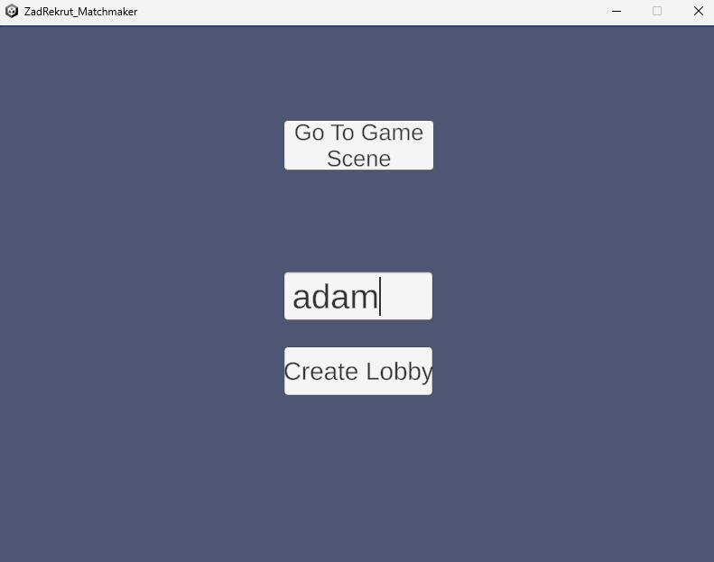
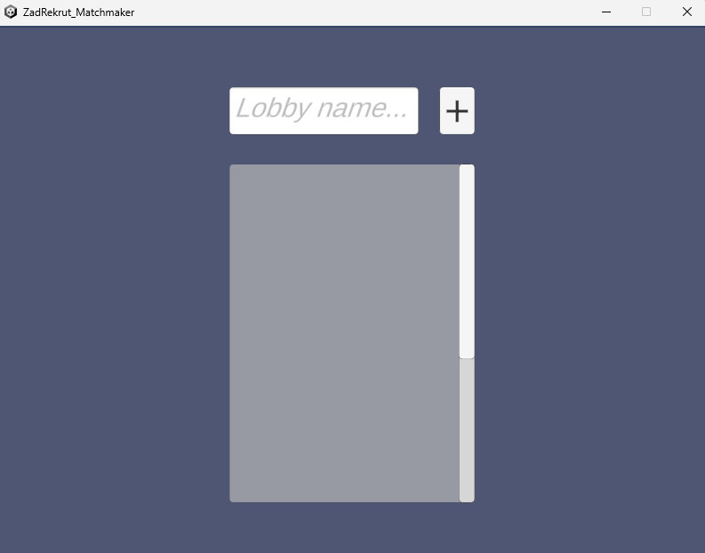
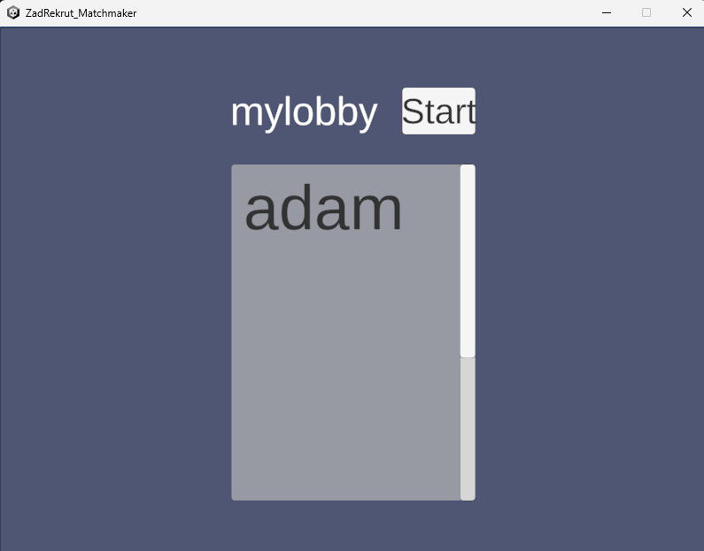
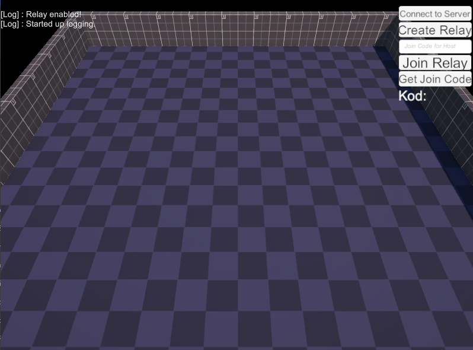
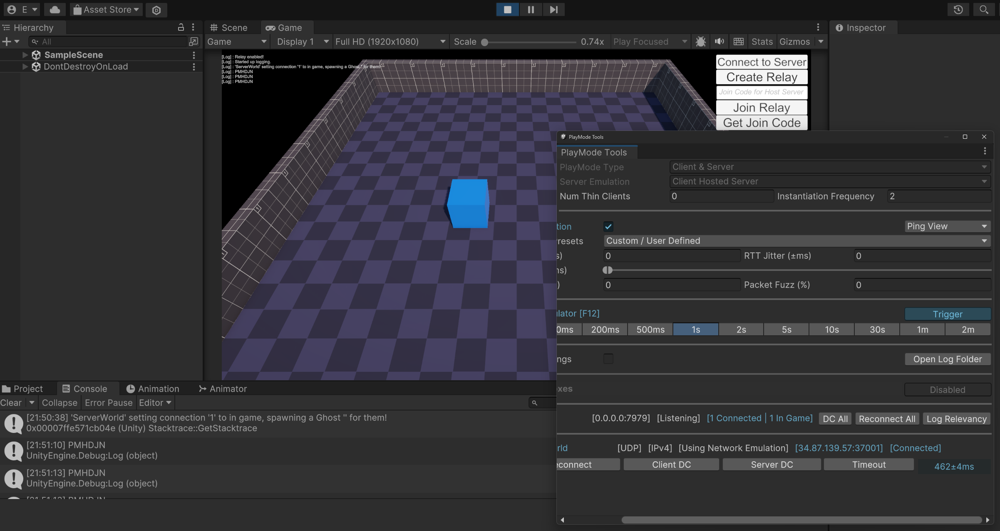

## This is my project for the task using Unity Gaming Services.
### I have successfully implemented Relay Server and Lobby.
Unfortunately I couldn't make it to work with second player, while using Relay Server, but was able to do so locally.
### I have also setup dedicated server in Unity Cloud with build and Fleet. Example shown in the image below.
For Hosting
[![Unity cloud]](ReadmeImages/unitycloud.png)
For Matchmaker
[![Unity cloud]](ReadmeImages/unitycloud-2.png)
However, this is where the project stands at.
I want to show you with some images of the project:

## Player profile creation

## Lobby list

## Lobby creation

## In Lobby 

## Scene before joining to server

## Unity editor showing connection to Relay

